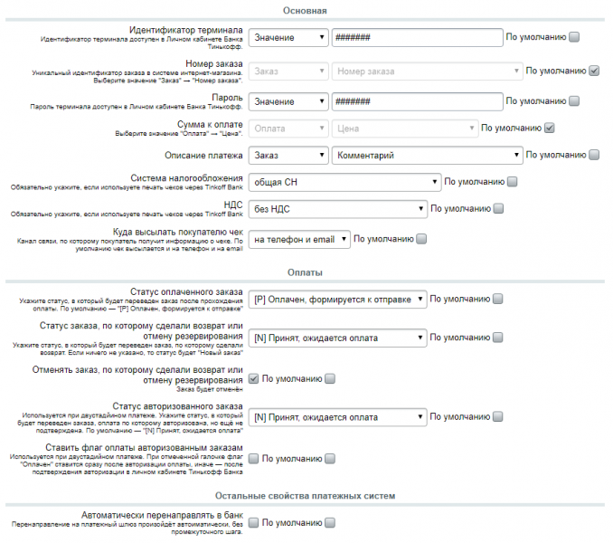
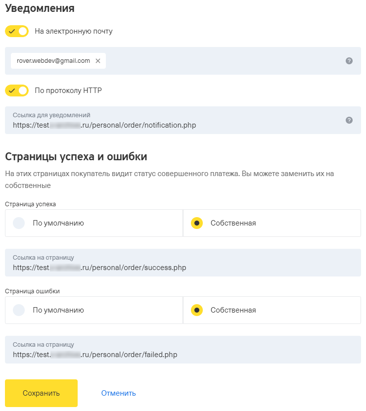

# payment.tinkoff

### Описание
Модуль позволяет подключить эквайринг Tinkoff bank к интернет-магазину на 1С Битрикс и принимать платежи по банковским картам (Visa, MasterCard, Мир), через интернет-банк Tinkoff.ru, Apple Pay и Google Pay из любых стран.

**Возможности**

✔ Автоматическая установка флага «Оплачено» при прохождении оплаты (если флаг не устанавливается, проверьте настройки на вкладке «Автоматизация процессов» модуля «Интернет-магазин» или настройки других сторонних модулей, связанных с обработкой заказа или оплаты).

* возможность выбора статуса заказа, в который он будет переведен после прохождения оплаты.
✔ Возврат денежных средств на карту покупателя штатными средствами интернет-магазина Bitrix.
возможность изменения статуса заказа, по которому был сделан возврат;

*возможность отмены такого заказа.

✔ Корректная работа с буквенно-цифровыми номерами заказов (например, 6B7R1, 8CB2A59X8X).

✔ Передача информации для печати чеков (54-ФЗ):

* через Банк Тинькофф (в обработчике платежей необходимо указать систему налогообложения и режим НДС);
* корректная передача названий автоматизированных служб доставки;
* если необходимо использовать сторонний сервис, то в настройках ПС оставьте галочку «Разрешить печать чеков», а в полях «НДС» или «Системы налогообложения установите» пустое значение, так чеки в Тинькофф отправляться не будут.

✔ Двухстадийный платеж:
* поддержка двухстадийного платежа с подтверждением через личный кабинет банка;
* выбор статуса, в который будут переводиться авторизованные заказы при двухстадийном платеже;
* возможность установить флаг оплаты для авторизованных заказов.

✔ Многосайтовость: установка обработчиков платежей на выбранные сайты.

✔ Кастомизация кнопки, отправляющей на платежный шлюз банка.
✔ Автоматическое перенаправление на платежный шлюз сразу после оформления заказа.

=============================================================================

### Установка

**_Настройки платежной системы в Битрикс_**

После установки модуля, в Битрикс появится новая платежная система. Ее необходимо включить и настроить.

1. Зайти в административную часть интернет-магазина.
2. Перейти на страницу Магазин → Настройки → Платежные системы.
3. Нажать кнопку "Добавить платежную систему".
4. Во вкладке «Платежная система» выбрать «Тинькофф банк (rover_tinkoff)» в поле «Обработчик».
5. Ввести заголовок, название, описание и сортировку платежной системы, и сделать ее активной.
6. Выбрать «Эквайринговая операция» в поле «Тип оплаты», выбрать кодировку модуля в поле
«Кодировка»
7. Снять все чекбоксы «по умолчанию» на вкладке «По умолчанию». Внимание! На вкладке «Физическое лицо» у всех параметров должны быть выставлены чекбоксы
«По умолчанию».
8. Заполнить форму платежной системы, руководствуясь подсказками к полям. Внимание! В поле "Сумма к оплате" обработчика платежа необходимо выбрать "Оплата" → "Цена". Настройка "Заказ" → "Стоимость заказа" не работает!
9. Нажать "Сохранить".

Для корректной работы модуля директива allow_url_fopen в php.ini должна быть включена (`allow_url_fopen = On`), а также с Вашего сервера должен быть доступ к **securepay.tinkoff.ru** по порту **443**. 

Проверить можно с помощью команды:
``
telnet securepay.tinkoff.ru 443.
``

Если ресурс недоступен, необходимо связаться с Вашим хостинг-провайдером и попросить открыть ресурс для отправки запросов.



**_Настройки платежного терминала Тинькофф Банк:_**
1. Включить нотификации по протоколу HTTP на ссылку для уведомлений вида - http(s)://домен_вашего_сайта/personal/order/notification.php
2. (опционально) поставить свои страницы успеха и ошибки вида http(s)://домен_вашего_сайта/personal/order/success.php и http(s)://домен_вашего_сайта/personal/order/failed.php соответственно.

_Если ваш сайт работает по http, то и в настройках со стороны Тинькофф должен стоять http. Аналогично c https. Иначе работа нотификаций не гарантируется!_



**_Настройка интеграции с онлайн-кассами_**

В настройках платежной системы необходимо:
1. Выбрать систему налогообложения магазина в раскрывающемся меню «Система налогообложения»
2. Выбрать необходимую ставку налога для доставки для передачи в чек в списке «НДС».


>* Если не указана «Система налогообложения» или «НДС», информация для печати чека передана не будет!
>* Доставка добавляется в чек отдельной позицией!

**Внимание!** Для корректной передачи данных чека в онлайн-кассу необходимо:
выставить для всех товаров магазина корректную ставку НДС;
указать в настройках модуля систему налогообложения и ставку налога для доставки.

**_Кастомизация шаблона кнопки_**

Кастомизация шаблона кнопки, ведущей на форму оплаты банка, приводится стандартным способом. Подробнее об этом в обучающем курсе: https://dev.1c-bitrix.ru/learning/course/?COURSE_ID=43&LESSON_ID=8485. Имя платежной системы — rover_tinkoff.

**_Пример кастомизации данных, передаваемых для печати чека_**

Заменяем все позиции на одну общую.

```php
<?php

$eventManager = \Bitrix\Main\EventManager::getInstance();
$eventManager->addEventHandler('rover.tinkoff', 'afterBuildReceipt', array('RoverReceipt', 'fix'));

class RoverReceipt
{
    /**
     * @param \Bitrix\Main\Event $event
     * @return \Bitrix\Main\EventResult
     */
    function fix(Bitrix\Main\Event $event)
    {
        /** @var \Bitrix\Sale\Order $order */
        $parameters = $event->getParameters();
        $order      = $parameters[0];
        $fields     = $parameters[1];
        $items      = $fields['Items'];

        $fields['Items'] =  [
            [
                'Name'      => 'Гайки и болты',
                'Price'     => $order->getPrice() * 100,
                'Quantity'  => 1,
                'Amount'    => $order->getPrice() * 100,
                'Tax'       => $items[0]['Tax']
            ]
        ];

        $parameters[1] = $fields;

        return new Bitrix\Main\EventResult(Bitrix\Main\EventResult::SUCCESS, $parameters, 'rover.tinkoff');
    }
}

```
**_Требования_**

расширение php-curl
«Главный модуль» Bitrix 16.5.9 и выше (на более низких работать не будет)
php 7.0 или выше.